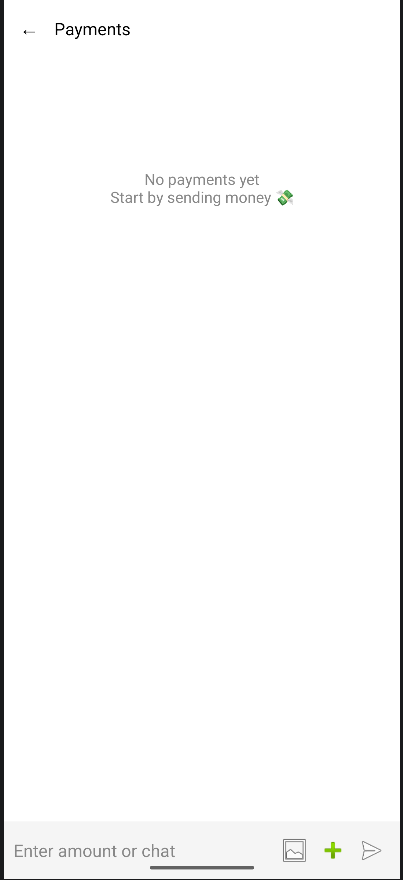
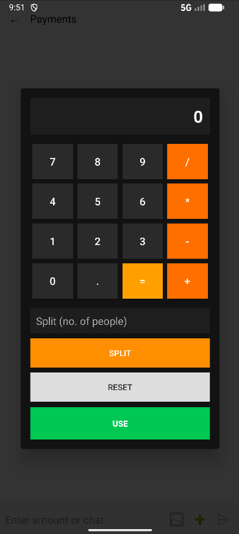
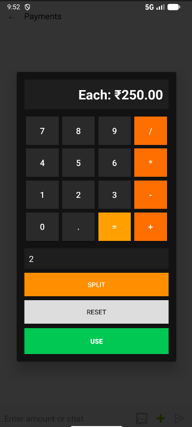

# 💸 Payment Calculator App

A smart Android payment UI with an integrated calculator and split feature — inspired by modern fintech apps.

---

## 🚀 Features

- 💬 Chat-style payment interface
- 🧮 Built-in calculator popup
- 🔢 Supports decimal calculations
- 👥 Split payments across multiple people
- 🔄 Reset and reuse calculations
- 📜 Dynamic transaction history
- 👤 Avatar-based UI
- 🎨 Premium gradient UI design

---

## 📱 Screenshots

---

## 🧠 Key Concepts Used

- Dynamic UI rendering (programmatic views)
- Dialog-based calculator design
- State management
- Input validation & formatting
- UX-driven design decisions

---

## 🛠️ Tech Stack

- Kotlin
- Android SDK
- XML Layouts

---

## 💡 Inspiration

Inspired by modern UPI apps like Google Pay & PhonePe, with a focus on improving usability by integrating a calculator directly into the payment flow.

---

## 🔮 Future Enhancements

- Save transaction history (local DB)
- Chat bubble alignment (left/right)
- Real profile images
- Animations & transitions

---

## 👨‍💻 Author

Your Name  
